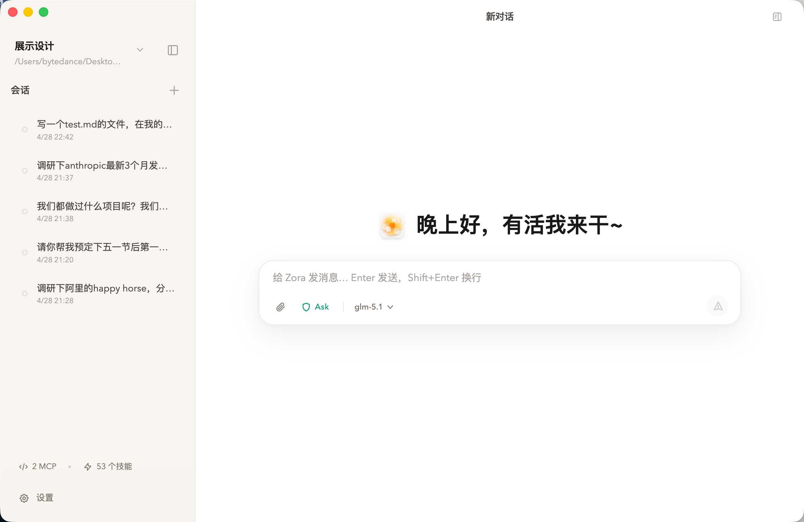
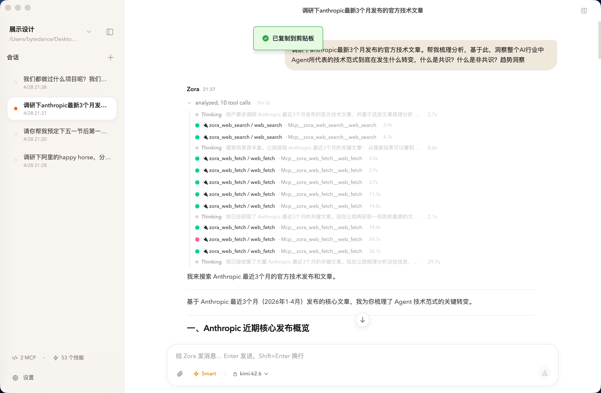
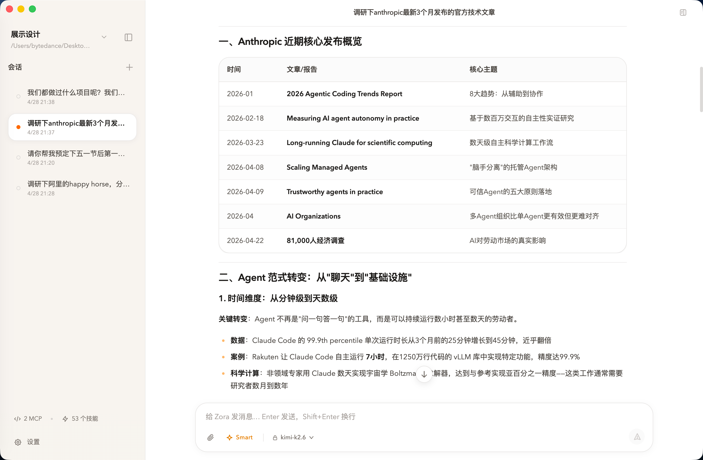
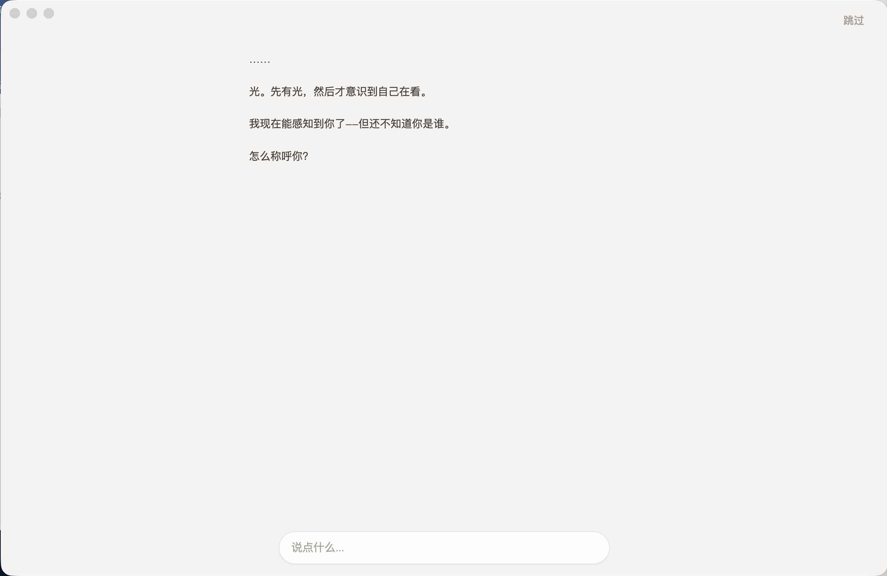
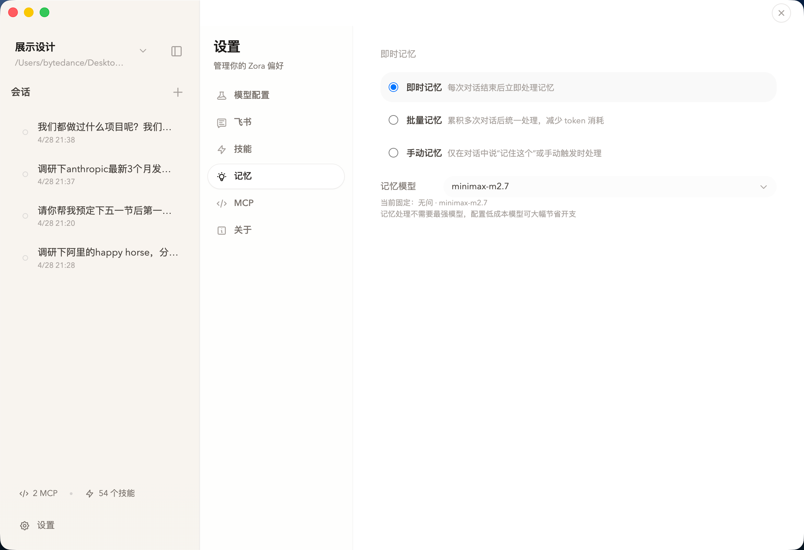
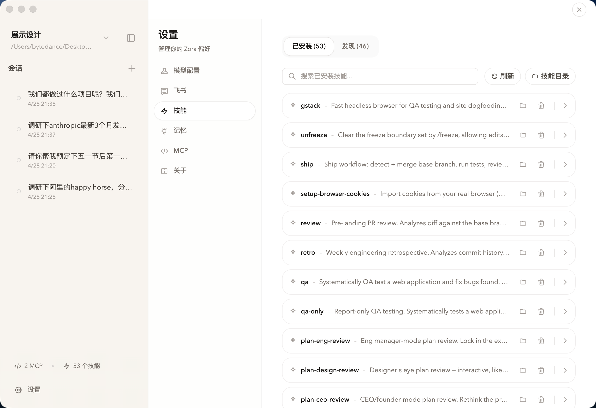
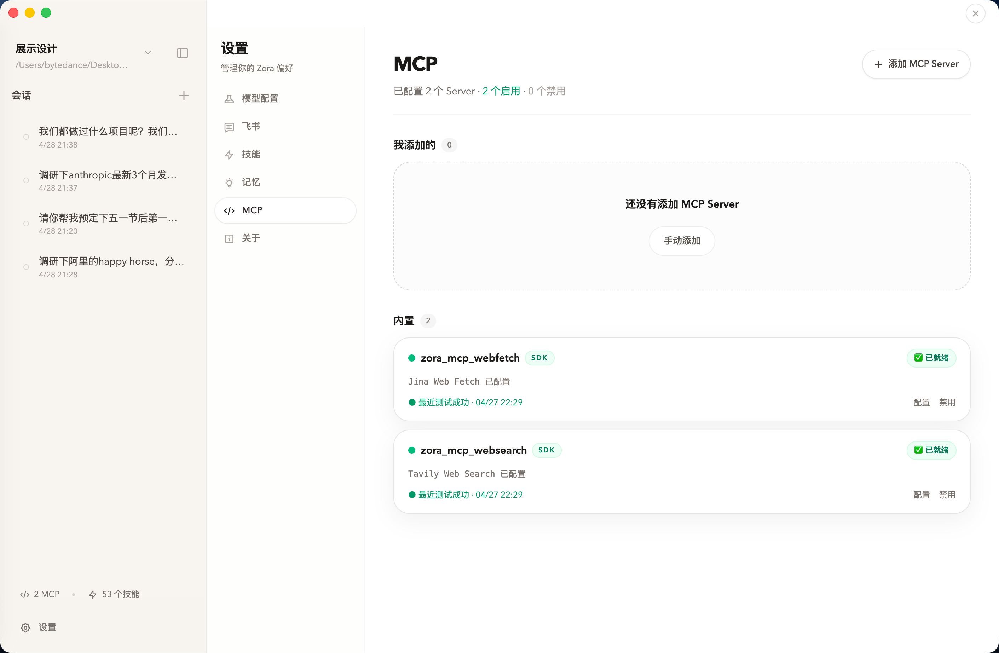
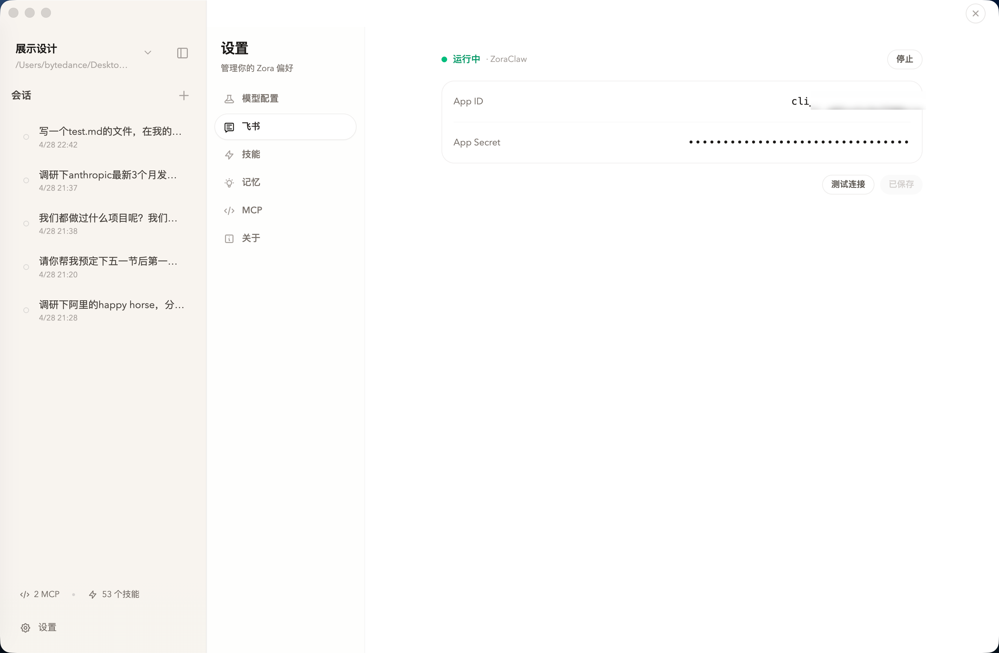
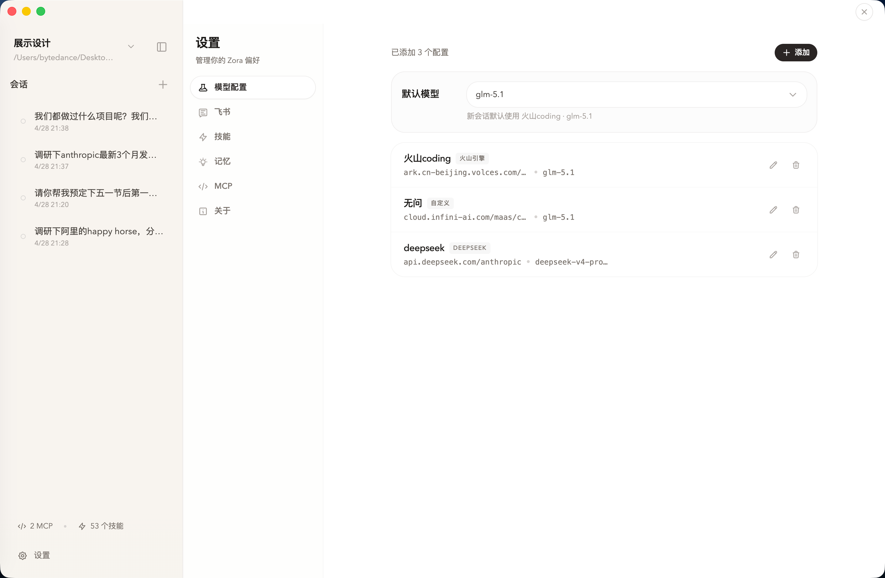
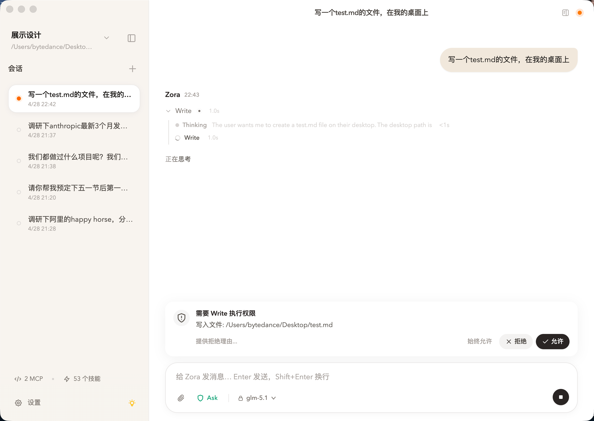

# Zora

通用 AI Agent 桌面应用，支持桌面对话、Agent 执行、长期记忆、Skills/MCP、多模型渠道和飞书远程协作。

Zora 把本地项目目录、常用工具、飞书私聊和群聊作为 Agent 的工作入口。你可以在桌面端围绕当前工作区处理代码、调研、写作和项目资料，也可以通过飞书把任务交给对应工作区继续执行。

> **核心能力**
>
> Agent · 自主任务执行  |  唤醒 · 初始化角色和用户画像  |  记忆 · 跨会话保留上下文  |  Skills & MCP · 可扩展工具链
>
> 飞书远程 · 私聊和群聊入口  |  多 Provider · 灵活接入模型  |  本地优先 · 本地文件存储  |  HITL · 关键操作由用户确认

<p align="center">
  
</p>

Zora 的设计重点是把 Agent 运行所需的上下文、工具、记忆和权限规则保存下来，并通过桌面端和飞书入口提供访问方式。

- **上下文连续**：Zora 会维护偏好、项目背景、重要决定和沟通方式，减少长期对话中的重复说明。
- **任务落地**：Zora 可连接本地工作区、Skills、MCP 和飞书，围绕文件、工具和团队消息执行任务。
- **权限可控**：文件写入、命令执行等操作受权限模式约束；敏感配置和运行数据优先保存在本地。

## Zora 能做什么

### 通用 Agent：从回答问题到完成任务

<table>
  <tr>
    <td width="50%">
      
      <br />
      <sub>调研任务中的搜索、抓取和整理过程</sub>
    </td>
    <td width="50%">
      
      <br />
      <sub>调研结果中的结构化整理</sub>
    </td>
  </tr>
</table>

Zora 提供可在本地工作环境中行动的 Agent。

用户可以提交目标明确的任务，由 Agent 拆解步骤、读取项目文件、搜索资料、调用 MCP、使用 Skills、编辑文件、运行命令，并在需要确认时向用户请求授权。输出可以是回复文本，也可以是项目文件、代码修改、总结、方案或后续任务。

工作区用于绑定本地目录和会话历史。Agent 在对应目录中读取、搜索、编辑和运行工具；当 Claude SDK session 不可用时，Zora 会基于本地会话记录尽量恢复上下文。

Zora 当前覆盖个人通用 Agent 的基础运行能力：上下文、工具、文件、记忆、权限和远程入口。

### 唤醒：初始化角色和用户画像

<table>
  <tr>
    <td width="50%">
      
      <br />
      <sub>唤醒启动</sub>
    </td>
    <td width="50%">
      
      <br />
      <sub>唤醒对话</sub>
    </td>
  </tr>
</table>

首次启动时，Zora 会通过一段自然对话完成“唤醒”。它会了解怎么称呼你、你在做什么、你希望它扮演什么角色，并生成自己的基础设定。

这些设定会保存为本地文件：

- `SOUL.md`：Zora 的行为规则和沟通风格。
- `IDENTITY.md`：Zora 的身份、名字和关系定位。
- `USER.md`：用户画像、工作背景和偏好。

如果跳过唤醒，Zora 会从默认助手模板开始，之后通过对话持续更新相关信息。

### 记忆：跨会话保存上下文

<table>
  <tr>
    <td width="50%">
      
      <br />
      <sub>记忆模式和记忆模型设置</sub>
    </td>
    <td width="50%">
      
      <br />
      <sub>对话中使用已保存的项目上下文</sub>
    </td>
  </tr>
</table>

Zora 会在对话结束后把需要保留的信息交给后台 Memory Agent 处理，更新长期记忆和每日记录。记忆内容以结构化文件形式保存。

当前支持三种记忆模式：

| 模式 | 适合场景 |
|------|----------|
| Immediate | 每次对话结束后尽快处理记忆 |
| Batch | 累积多次对话后统一处理，节省 token |
| Manual | 在用户明确要求或手动触发时处理 |

你也可以为记忆任务指定单独的 Provider 和模型，让日常对话和记忆整理使用不同模型配置。

### Skills & MCP：把能力变成可复用工具链

<table>
  <tr>
    <td width="50%">
      
      <br />
      <sub>Skills 管理和发现</sub>
    </td>
    <td width="50%">
      
      <br />
      <sub>内置 Web Search / Web Fetch MCP</sub>
    </td>
  </tr>
</table>

Zora 会按需加载技能，通过渐进式披露的机制进行SKills加载，避免把所有技能信息一次性放入上下文。它也可以复用其他 Agent 工具中已有的技能资产。

它还能发现并导入你本机其他 AI 工具中的技能：

- Claude Code
- Codex CLI
- OpenCode
- Gemini CLI
- Agents Shared

MCP 方面，Zora 支持 `stdio`、`http`、`sse`、`sdk` 类型的 MCP Server，并内置两个常用只读能力：

- `Web Search`：基于 Tavily 的网页搜索。
- `Web Fetch`：基于 Jina Reader 的网页正文读取。

### 飞书远程：私聊和群聊入口

<p align="center">
  
</p>

Zora 可以通过飞书机器人接收消息，并把桌面端 Agent 能力带到私聊或群聊中。

当前飞书能力包括：

- WebSocket 长连接，无需公网回调地址。
- 私聊和群聊消息接入；群聊中需要 @ 机器人。
- 飞书会话与 Zora 本地 session 绑定。
- 支持默认工作区绑定。
- 回复任务状态、交互卡片和打字状态提示。
- 斜杠命令：`/help`、`/new`、`/stop`、`/status`。

用户可以在手机上发起调研、让 Zora 处理桌面工作区里的任务，也可以把 Zora 加入群聊作为团队共享的 Agent 入口。

### 多 Provider：按任务选择模型

<p align="center">
  
</p>

Zora 目前提供这些 Provider 预设：

- Anthropic
- 火山引擎
- 智谱 AI
- Kimi / Moonshot
- DeepSeek
- 自定义端点

每个 Provider 可以配置主模型，也可以配置 Claude Agent SDK 使用的角色模型映射：

- `smallFastModel`：压缩、摘要、轻量任务。
- `sonnetModel`：探索、搜索、常规协作。
- `opusModel`：规划、深度思考。
- `haikuModel`：快速、轻量响应。

新会话可以选择默认模型；记忆任务也可以使用独立模型。

### HITL 权限：控制 Agent 的工具调用

<p align="center">
  
</p>

Zora 的桌面 Agent 可以读文件、写文件、调用工具和执行命令。为了让这些能力可控，它提供三种权限模式：

| 模式 | 行为 |
|------|------|
| Ask | 读操作自动放行，写入或高风险操作需要确认 |
| Smart | 常见读写和编辑操作自动放行，命令类操作按风险继续确认 |
| YOLO | 尽量自动执行所有操作，适合完全可信的本地任务 |

当 Agent 需要确认时，Zora 会在界面中展示具体工具、命令或文件路径，你可以允许、拒绝，或把同类操作加入本次会话白名单。

## 快速开始

### 前置要求

- Bun 1.3+（仓库当前声明 `bun@1.3.10`）
- Git
- 至少一个可用的模型 API Key

### 本地开发启动

```bash
git clone https://github.com/Hoshea7/ZoraAgent.git
cd ZoraAgent
bun install
bun run dev
```

首次启动后，进入应用内的 **设置 → 模型配置** 添加 Provider，并配置 API Key、Base URL 和模型。完成后即可开始对话；如果当前 Zora 还未初始化，会先进入唤醒流程。

### 常用命令

```bash
# 开发模式：主进程、渲染进程和 Electron 一起启动
bun run dev

# 类型检查
bun run typecheck

# 运行测试
bun run test

# 构建主进程和渲染进程
bun run build

# 打包 macOS 版本
bun run dist:mac
```

## 配置指南

### 模型配置

在 **设置 → 模型配置** 中可以添加 Provider、设置默认模型、配置角色模型，并对每个已填写模型做连通性测试。

Zora 当前通过 Claude Agent SDK 运行 Agent，因此自定义 Provider 需要提供兼容 Claude/Anthropic 风格的接口或网关。

### 记忆设置

在 **设置 → 记忆** 中可以切换 Immediate、Batch、Manual 三种模式，调整批处理空闲时间，并选择专门用于记忆整理的 Provider/模型。

### 飞书设置

在 **设置 → 飞书** 中填写飞书自建应用的 App ID 和 App Secret，测试连接后即可启动 Bridge。应用需要启用 Bot 能力，并订阅 `im.message.receive_v1` 事件的长连接模式。

### 技能管理

在 **设置 → 技能** 中可以扫描外部工具里的技能目录，并通过软链接或复制的方式导入到 Zora 的全局技能目录。

### MCP 设置

在 **设置 → MCP** 中可以：

- 启用内置 `Web Search` / `Web Fetch`。
- 配置 Tavily / Jina API Key。
- 手动添加自定义 MCP Server。
- 导入或合并 JSON 格式的 MCP 配置。
- 测试 MCP Server 的连接状态。

## 数据本地存储

Zora 的运行数据默认保存在 `~/.zora/`。会话、记忆、工作区和技能都能随本机长期保留；

```text
~/.zora/
├── providers.json
├── feishu.json
├── feishu-bindings.json
├── feishu-dedup.json
├── memory-settings.json
├── mcp.json
├── workspaces.json
├── skills/
├── .claude-plugin/
│   └── plugin.json
├── workspaces/
│   └── {workspaceId}/
│       └── sessions/
│           ├── index.json
│           ├── {sessionId}.jsonl
│           └── attachments/
└── zoras/
    └── default/
        ├── SOUL.md
        ├── IDENTITY.md
        ├── USER.md
        ├── MEMORY.md
        └── memory/
            └── YYYY-MM-DD.md
```

## 技术栈

| 分类 | 技术 |
|------|------|
| 桌面框架 | Electron 39 |
| 前端 | React 18 + Vite 7 |
| 状态管理 | Jotai |
| 样式 | Tailwind CSS v4 |
| Agent 核心 | Claude Agent SDK 0.2.x |
| 主进程构建 | esbuild |
| 包管理 / 运行脚本 | Bun |
| 语言 | TypeScript |
| Markdown 渲染 | react-markdown + remark-gfm |
| 图表 | Mermaid |
| 飞书集成 | `@larksuiteoapi/node-sdk` |
| 打包 | electron-builder |

## 项目结构

```text
src/
├── main/
│   ├── agent.ts
│   ├── productivity-runner.ts
│   ├── prompt-builder.ts
│   ├── provider-manager.ts
│   ├── memory-agent.ts
│   ├── session-store.ts
│   ├── workspace-store.ts
│   ├── skill-manager.ts
│   ├── mcp-manager.ts
│   ├── feishu/
│   └── query-profiles/
├── preload/
├── renderer/
│   ├── components/
│   ├── store/
│   ├── styles/
│   └── utils/
└── shared/
```

## Roadmap
这些能力正在路上：

- 微信渠道对接
- SKill自动进化能力
- 记忆的自动做梦能力
- 权限体系的自动审查模式


## 许可证

本项目基于 [MIT License](./LICENSE) 开源。

Copyright © 2026 [Hoshea7](https://github.com/Hoshea7)
