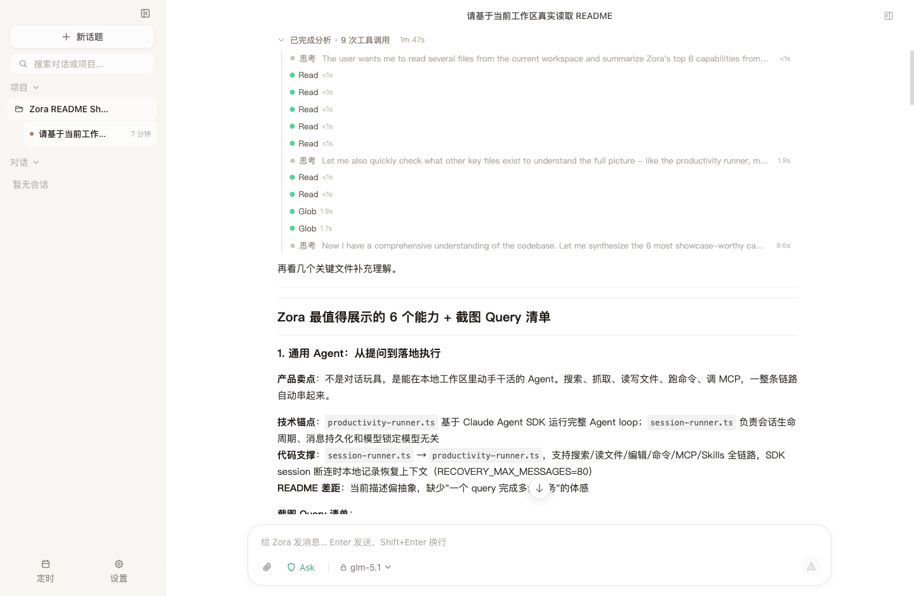
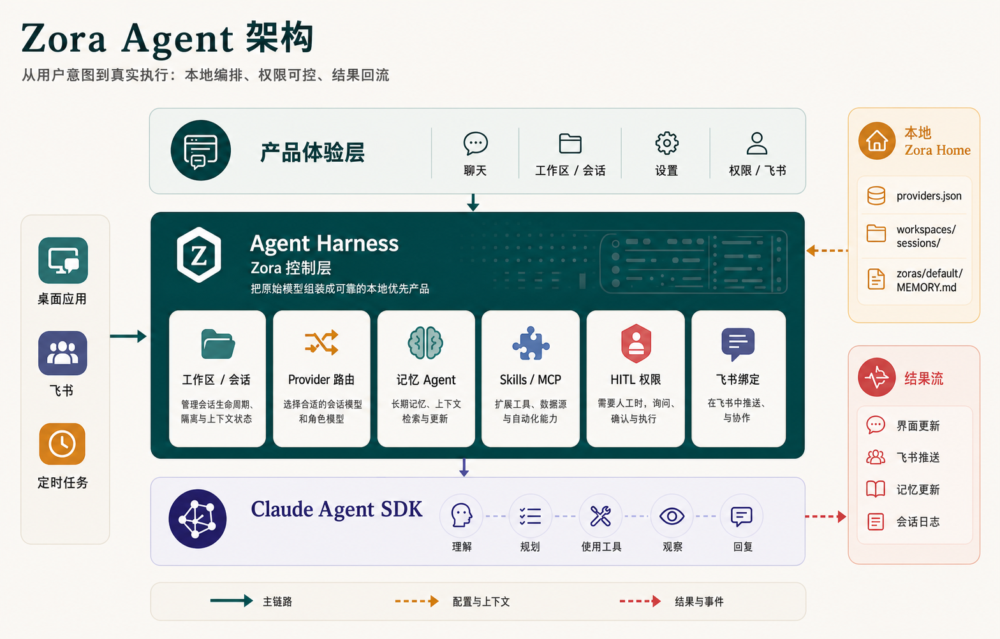
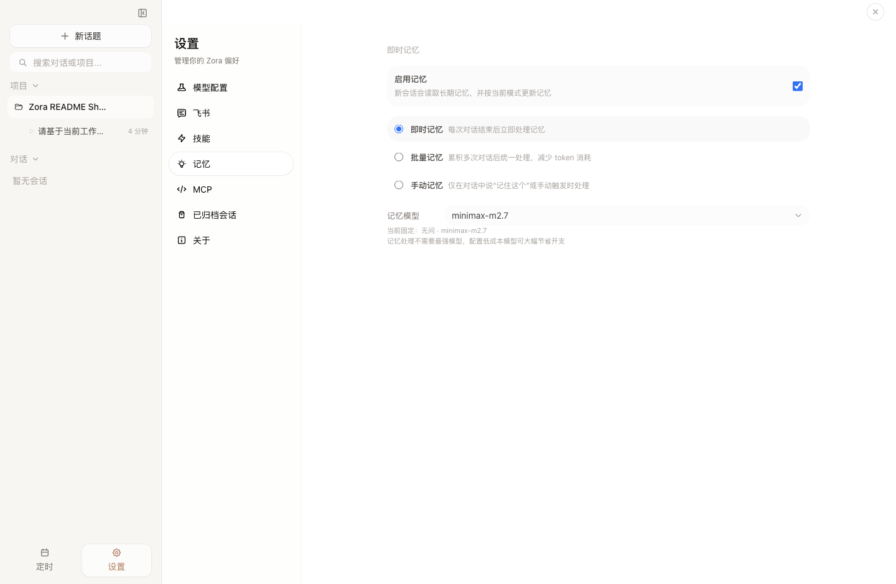
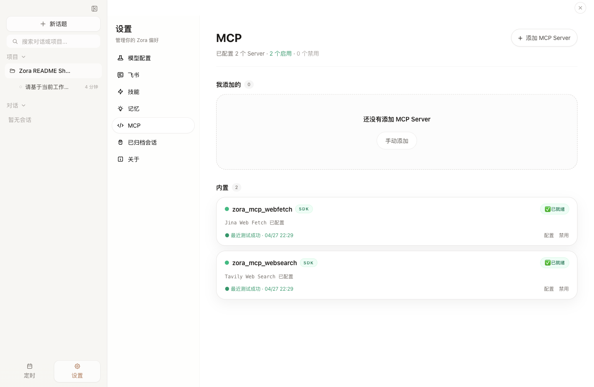
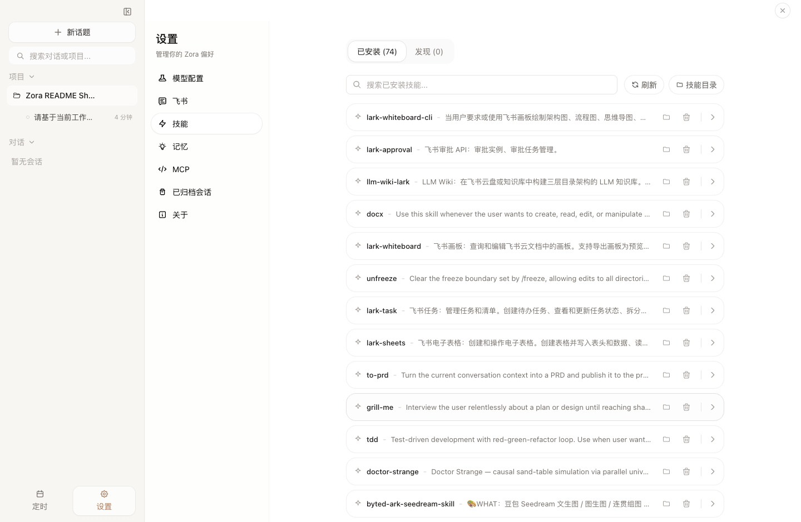

# Zora

Zora 是一个本地优先的桌面 Agent 工作台。它把项目 Workspace、会话历史、长期记忆、Skills/MCP、多模型 Provider、HITL 权限和飞书远程入口串在一起，让 Agent 可以在真实工作目录里读文件、调用工具、运行命令、写结果，并把关键上下文保存在本机 `.zora/`。

<p align="center">
  
</p>

<p align="center">
  <sub>真实只读运行截图：Zora 在当前仓库中读取 README、package.json 和主进程关键模块，并基于工具调用结果总结产品能力。</sub>
</p>

## 核心能力

| 能力 | 说明 |
|------|------|
| Workspace & Session | 每个工作区绑定一个本地目录，Session 记录用户消息、Agent 输出、工具过程和附件。 |
| 真实 Agent Loop | 通过 Claude Agent SDK 执行任务，支持读取/搜索文件、调用工具、运行命令、流式返回过程和结果。 |
| 多 Provider | 支持 Anthropic、火山引擎、智谱、Moonshot、DeepSeek 和自定义兼容端点；会话模型和记忆模型可分开配置。 |
| Memory Agent | 对话结束后可按 Immediate、Batch 或 Manual 模式整理长期记忆和每日记录。 |
| Skills & MCP | 扫描并导入本机技能目录，支持 `stdio`、`http`、`sse`、`sdk` MCP Server，并内置 Web Search / Web Fetch。 |
| HITL 权限 | Ask、Smart、YOLO 三种权限模式；写文件、运行命令和高风险工具可由用户确认或加入会话白名单。 |
| 飞书远程 | 通过飞书机器人接收私聊/群聊任务，把移动端消息绑定到本地 Workspace 和 Session。 |
| 定时入口 | 桌面端提供定时任务入口，并通过内置 MCP 能力接入 Agent 执行链路。 |

## 架构

<p align="center">
  
</p>

这张图的读法不是“模块依赖全景图”，而是 Zora 把一次用户请求变成真实 Agent 执行的主链路：

- **产品体验层**负责入口和状态。桌面端、飞书、定时任务、设置页和权限提示都属于这一层。它让用户发起任务、看见过程、确认风险、接收结果。
- **Agent Harness 层是 Zora 的控制层**。它不是简单转发消息，而是在调用 SDK 之前把产品上下文组装完整：选择 Workspace/Session、锁定 Provider 和模型、注入记忆、加载 Skills/MCP、套用 HITL 权限策略、绑定飞书会话，并把这些信息整理成一次可执行的 Agent Profile。
- **Claude Agent SDK 链路层**负责执行。SDK 处理理解任务、规划工具、调用工具、观察结果和回复生成；Zora 接收 SDK events，把工具步骤、日志、结果和记忆处理继续回流到 UI、飞书和本地 `.zora/`。

换句话说，SDK 是执行引擎，Agent Harness 是驾驶舱。Zora 的产品价值主要发生在 Harness：它决定 Agent 在哪个目录工作、能用哪些工具、用哪个模型、带着哪些长期记忆、哪些操作必须问用户，以及任务结束后如何沉淀为会话和记忆。

## 产品截图

<table>
  <tr>
    <td width="33%">
      
      <br />
      <sub>记忆模式和记忆模型可以独立配置</sub>
    </td>
    <td width="33%">
      
      <br />
      <sub>内置 Web Fetch / Web Search MCP，并支持自定义 Server</sub>
    </td>
    <td width="33%">
      
      <br />
      <sub>扫描、导入和管理本机 Skills</sub>
    </td>
  </tr>
</table>

## 典型工作流

1. 在桌面端选择或创建 Workspace，让 Zora 绑定一个真实项目目录。
2. 输入任务，选择权限模式和模型；Zora 会创建 Session 并持久化用户消息。
3. Harness 读取当前 Workspace、Provider、Memory、Skills、MCP 和权限配置，构造 Claude Agent SDK Profile。
4. Agent 运行时把思考、工具调用、工具结果、权限请求和最终回复流式回传到 UI。
5. 会话结束后，Zora 写入 Session JSONL，并按记忆设置触发 Memory Agent。
6. 如果任务来自飞书，Zora 会把飞书私聊或群聊消息绑定到本地 Session，并把状态和结果回发到飞书。

## 展示 Query 示例

这些 Query 适合用来演示真实能力，可以直接在当前仓库或真实工作区运行：

```text
请基于当前工作区真实读取 README.md、package.json、src/main/session-runner.ts、
src/main/mcp-manager.ts 和 src/main/hitl.ts，不要修改任何文件。

请用产品 README 的视角总结 Zora 当前最值得展示的 6 个能力，
并给出适合截图展示的 query 清单。回复要结构化，能直接指导 README 改写。
```

```text
请先阅读当前仓库的 src/main/query-profiles、src/main/memory-agent.ts
和 src/main/feishu 目录，然后画出 Zora 从桌面/飞书收到任务到 Agent 返回结果的链路。
不要修改文件，只输出结构化说明和 Mermaid 草案。
```

```text
在 Ask 权限模式下，帮我检查 README 里的能力描述是否和当前代码一致。
如果发现不一致，只列出问题和建议补丁，不要直接修改。
```

## 快速开始

### 前置要求

- Bun 1.3+
- Git
- 至少一个可用的模型 API Key 或兼容 Claude/Anthropic 风格接口的网关

### 本地开发启动

```bash
git clone https://github.com/Hoshea7/ZoraAgent.git
cd ZoraAgent
bun install
bun run dev
```

首次启动后，进入 **设置 -> 模型配置** 添加 Provider，填写 API Key、Base URL 和模型。配置完成后即可创建 Workspace 并开始对话；如果当前 Zora 还没有初始化，会先进入唤醒流程。

### 常用命令

```bash
# 开发模式：主进程、渲染进程和 Electron 一起启动
bun run dev

# 类型检查
bun run typecheck

# 全量测试
bun run test

# L1 / L2 分层测试
bun run test:unit
bun run test:integration

# 真实 SDK 诊断
bun run test:live

# 构建主进程和渲染进程
bun run build

# 打包 macOS 版本
bun run dist:mac
```

## 配置

### 模型配置

Zora 通过 Claude Agent SDK 运行 Agent。每个 Provider 可以设置默认模型，也可以配置 SDK 角色模型映射：

- `smallFastModel`：压缩、摘要、轻量任务。
- `sonnetModel`：探索、搜索、常规协作。
- `opusModel`：规划、深度任务。
- `haikuModel`：快速响应。

新会话可以选择当前模型；Memory Agent 也可以使用独立 Provider 和模型。

### 记忆设置

Zora 支持三种记忆模式：

| 模式 | 适合场景 |
|------|----------|
| Immediate | 每次对话结束后尽快整理记忆。 |
| Batch | 累积多次对话后统一处理，节省 token。 |
| Manual | 只在用户手动触发时处理。 |

记忆内容默认保存在本机 Zora 数据目录中，包括长期记忆、用户画像和每日记录。

### Skills & MCP

技能管理页可以扫描并导入本机其他 Agent 工具中的技能资产，例如 Claude Code、Codex CLI、OpenCode、Gemini CLI 和共享技能目录。

MCP 设置页支持：

- 启用内置 `Web Search` / `Web Fetch`。
- 配置 Tavily / Jina API Key。
- 手动添加自定义 MCP Server。
- 导入或合并 JSON 格式 MCP 配置。
- 测试 MCP Server 连接状态。

### 飞书设置

在 **设置 -> 飞书** 中填写飞书自建应用的 App ID 和 App Secret，测试连接后即可启动 Bridge。应用需要启用 Bot 能力，并订阅 `im.message.receive_v1` 事件的长连接模式。

当前飞书能力包括：

- WebSocket 长连接，无需公网回调地址。
- 私聊和群聊消息接入；群聊中需要 @ 机器人。
- 飞书会话与 Zora 本地 Session 绑定。
- 支持默认 Workspace 绑定。
- 回复任务状态、交互卡片和打字状态提示。
- 斜杠命令：`/help`、`/new`、`/stop`、`/status`。

### 权限模式

| 模式 | 行为 |
|------|------|
| Ask | 读操作自动放行，写入或高风险操作需要确认。 |
| Smart | 常见读写和编辑操作自动放行，命令类操作按风险继续确认。 |
| YOLO | 尽量自动执行所有操作，适合完全可信的本地任务。 |

当 Agent 需要确认时，Zora 会展示具体工具、命令或文件路径。用户可以允许、拒绝，或把同类操作加入本次会话白名单。

## 本地数据

Zora 的运行数据默认保存在 `~/.zora/`。开发和测试时也可以通过 `ZORA_HOME` 指向隔离目录。

```text
~/.zora/
├── providers.json
├── feishu.json
├── feishu-bindings.json
├── feishu-dedup.json
├── memory-settings.json
├── mcp.json
├── workspaces.json
├── skills/
├── .claude-plugin/
│   └── plugin.json
├── workspaces/
│   └── {workspaceId}/
│       └── sessions/
│           ├── index.json
│           ├── {sessionId}.jsonl
│           └── attachments/
└── zoras/
    └── default/
        ├── SOUL.md
        ├── IDENTITY.md
        ├── USER.md
        ├── MEMORY.md
        └── memory/
            └── YYYY-MM-DD.md
```

敏感配置如 API Key、飞书 Secret 和 MCP Key 都保存在本地配置文件中，不应提交到仓库。

## 技术栈

| 分类 | 技术 |
|------|------|
| 桌面框架 | Electron 39 |
| 前端 | React 18 + Vite 7 |
| 状态管理 | Jotai |
| 样式 | Tailwind CSS v4 |
| Agent 核心 | Claude Agent SDK `^0.2.76` |
| 飞书集成 | `@larksuiteoapi/node-sdk` |
| Markdown / 图表 | react-markdown + remark-gfm + Mermaid |
| 主进程构建 | esbuild |
| 包管理 / 运行脚本 | Bun |
| 语言 | TypeScript |
| 打包 | electron-builder |

## 项目结构

```text
src/
├── main/
│   ├── agent.ts
│   ├── session-runner.ts
│   ├── productivity-runner.ts
│   ├── prompt-builder.ts
│   ├── provider-manager.ts
│   ├── memory-agent.ts
│   ├── session-store.ts
│   ├── workspace-store.ts
│   ├── skill-manager.ts
│   ├── mcp-manager.ts
│   ├── hitl.ts
│   ├── feishu/
│   └── query-profiles/
├── preload/
├── renderer/
│   ├── components/
│   ├── store/
│   ├── styles/
│   └── utils/
└── shared/
```

## 测试与巡检

```bash
# L1：纯函数和单模块逻辑
bun run test:unit

# L2：多模块集成
bun run test:integration

# 真实 Provider / SDK 诊断
bun run test:live

# GUI 产品巡检入口
bun run test:gui:init
bun run test:gui:init:local-provider
```

GUI 产品巡检剧本维护在 `qa/gui/`，测试产物会写入 `tests/.artifacts/gui/`。

## Roadmap

- 微信渠道对接
- Skills 自动进化
- 记忆自动整理和回顾增强
- 权限体系的自动审查模式
- 更完整的 GUI 产品巡检覆盖

## 许可证

本项目基于 [MIT License](./LICENSE) 开源。

Copyright © 2026 [Hoshea7](https://github.com/Hoshea7)
